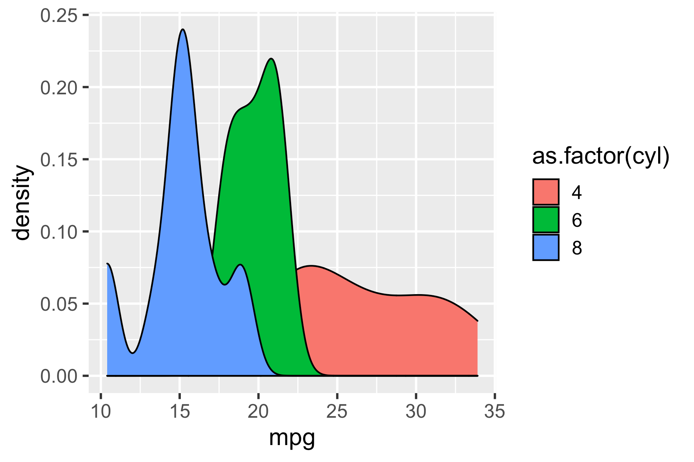
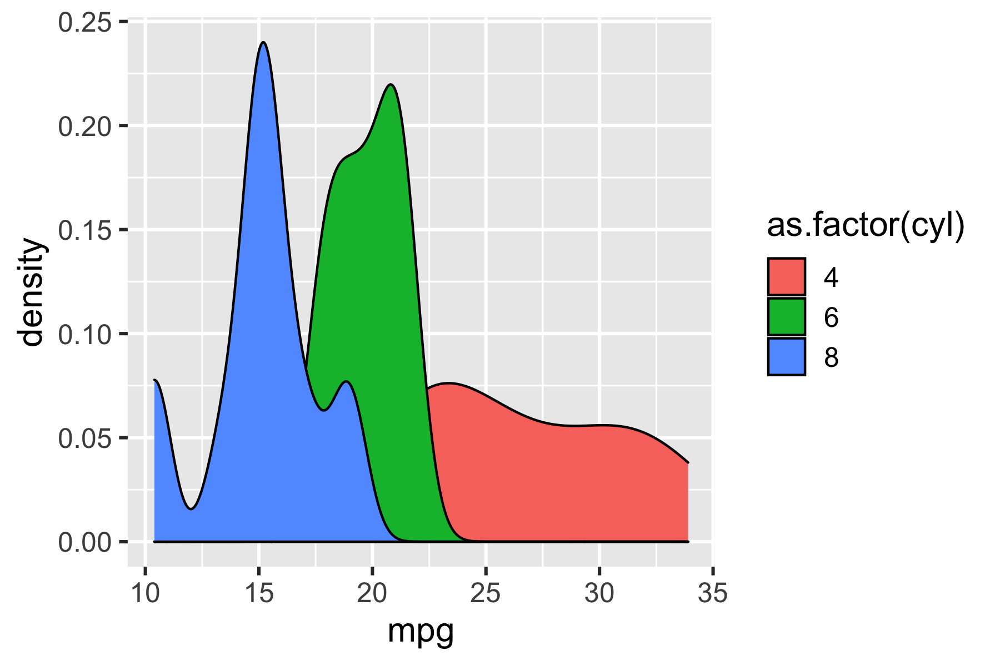
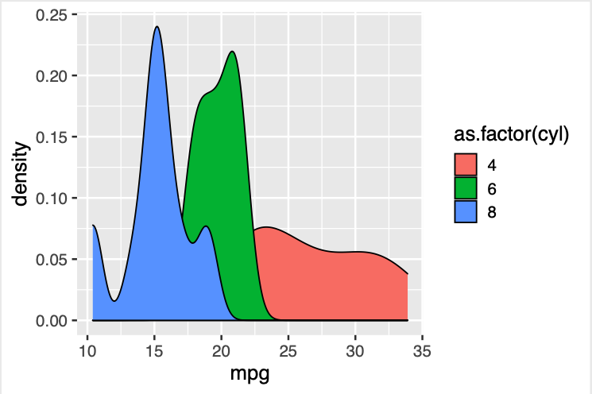
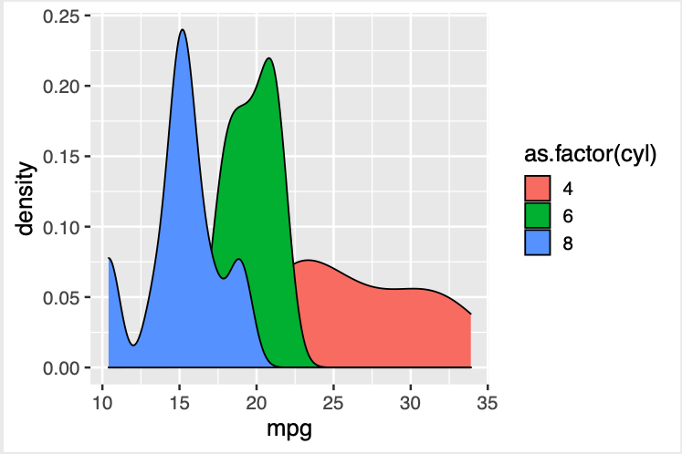

<!-- README.md is generated from README.Rmd. Please edit that file -->

```{r, include = FALSE}
knitr::opts_chunk$set(
  collapse = TRUE,
  comment = "#>",
  fig.path = "man/figures/README-",
  out.width = "100%"
)

library(dplyr)
library(ggplot2)
library(optout)
library(withr)
```

# optout - Optimized Graphics Output

<!-- badges: start -->

<!-- badges: end -->


This package enables access to some common command-line image optimization and 
compression tools from within R, with a mostly consistent call interface.

Tools are included for interfacing command line tools for compressing
JPG, PNG and PDF files.

**My use case** - the vignettes for [ggpattern](https:/github.com/coolbutuseless/ggpattern) 
are huge because of the image example, and I wanted to be able to optimize and 
compress images from within the vignette *Rmd* files.


Security Warning
------------------------------------------------------------------------------

This package does a lot of `system2()` calls with user input.  I've 
sanitised all user input, but nothing is ever perfect, so in general 
this library should not accept input from the internet e.g. as part of a shiny 
app.


## Installation

You can install the development version from [GitHub](https://github.com/coolbutuseless/optout) with:

``` r
# install.packages("remotes")
remotes::install_github("coolbutuseless/optout")
```

This package relies on your system having installed the following command line 
programs.  If a particular utility is not installed, the package will still 
load fine, but you will not be able to use that particular compression type.

* PNG compression
    * [pngquant](https://pngquant.org/)
    * [optpng](http://optipng.sourceforge.net/)
    * [pngcrush](https://pmt.sourceforge.io/pngcrush/)
    * [zopfli + zopflipng](https://github.com/google/zopfli)
* JPEG compression
    * [jpegoptim](https://github.com/tjko/jpegoptim)
* PDF compression
    * [ghostscript](https://www.ghostscript.com/)


Overview of available compressors
------------------------------------------------------------------------------

| filetype | compressor | lossless | default options                       |
|----------|------------|----------|---------------------------------------|
| png      | pngquant   | no       | speed = 4, dither = FALSE             |
| png      | pngcrush   | yes      | brute = FALSE                         |
| png      | optipng    | yes      | level = 1                             |
| png      | zopflipng  | yes      | lossy_alpha = FALSE, lossy_8bit  = FALSE, more = FALSE, insane = FALSE |
| jpeg     | jpegoptim  | optional | quality = NULL, size = NULL (i.e. lossless)           |
| pdf      | pdfopt     | no       | quality = 'screen'                    |


Sample Plot
------------------------------------------------------------------------------

```{r}
ggplot(mtcars) + 
  geom_density(aes(mpg, fill = as.factor(cyl))) + 
  theme_gray(15)
```


```{r eval = FALSE}
dpi <- 72
ggsave("man/figures/png-orig.png", p, width = 6, height = 4)
ggsave("man/figures/jpg-orig.jpg", p, width = 6, height = 4)
ggsave("man/figures/pdf-orig.pdf", p, width = 6, height = 4)
```


Example: Optimizing PNG output
------------------------------------------------------------------------------


```{r}
r1 <- pngquant (infile = "man/figures/png-orig.png", outfile = "man/figures/png-pngquant.png" , verbosity = 1)
r2 <- pngcrush (infile = "man/figures/png-orig.png", outfile = "man/figures/png-pngcrush.png" , verbosity = 1)
r3 <- optipng  (infile = "man/figures/png-orig.png", outfile = "man/figures/png-optipng.png"  , verbosity = 1)
r4 <- zopflipng(infile = "man/figures/png-orig.png", outfile = "man/figures/png-zopflipng.png", verbosity = 1)
```

<div>

<div style="width:45%; float:left;">
<h4>Orig PNG</h4>

</div>

</div>
<div style="clear:both;" />


<div style="width:45%; float:left;">
<h4>pngquant - space saving `r round(r1$space_saving * 100)`% </h4>

</div>

<div style="width:45%; float:left;">
<h4>pngcrush - space saving `r round(r2$space_saving * 100)`% </h4>

</div>

<div style="width:45%; float:left;">
<h4>optipng - space saving `r round(r3$space_saving * 100)`% </h4>

</div>

<div style="width:45%; float:left;">
<h4>zopflipng - space saving `r round(r4$space_saving * 100)`% </h4>

</div>

</div>
 
<div style="clear:both;" />


Example: Optimizing JPEG output
------------------------------------------------------------------------------

```{r}
r5 <- jpegoptim(
  infile    = "man/figures/jpg-orig.jpg", 
  outfile   = "man/figures/jpg-jpegoptim-lossless.jpg" , 
  verbosity = 1
)


r6 <- jpegoptim(
  infile    = "man/figures/jpg-orig.jpg", 
  outfile   = "man/figures/jpg-jpegoptim-lossy-size.jpg",
  size      = 50,  
  verbosity = 1
)


r7 <- jpegoptim(
  infile    = "man/figures/jpg-orig.jpg", 
  outfile   = "man/figures/jpg-jpegoptim-lossy-quality.jpg", 
  quality   = 10,
  verbosity = 1
)
```


<div>

<div style="width:45%; float:left;">
<h4>Orig JPG</h4>
<span>.</span>

</div>

<div style="width:45%; float:left;">
<h4>jpegoptim - lossless </h4>
Space saving `r round(r5$space_saving * 100)`% 

</div>

<div style="width:45%; float:left;">
<h4>jpegoptim - target size 50kB </h4>
Space saving `r round(r6$space_saving * 100)`% 

</div>

<div style="width:45%; float:left;">
<h4>jpegoptim - target quality 10 </h4>
Space saving `r round(r7$space_saving * 100)`% 

</div>

</div>
<div style="clear:both;" />


Example: Optimizing PDF output
------------------------------------------------------------------------------

```{r}
r8 <- pdfopt(infile = "man/figures/pdf-orig.pdf", outfile = "man/figures/pdf-pdfopt.pdf", verbosity = 1)
```


<div>

<div style="width:45%; float:left;">
<h4>Orig PDF</h4>
<span>.</span>

</div>

<div style="width:45%; float:left;">
<h4>pdfopt</h4>
Space saving `r round(r8$space_saving * 100)`% 

</div>


</div>
<div style="clear:both;" />


Speed
------------------------------------------------------------------------------

Most optimizers run in reasonable time i.e. ~1 second for a single file. 

`zopflipng` is the exception and with higher compression options you will see
the heat death of the universe before you will see it finish.  Even at its lowest
settings (the default) it will take tens-of-seconds up to several minutes to 
compress a file.  **Use with caution!**


